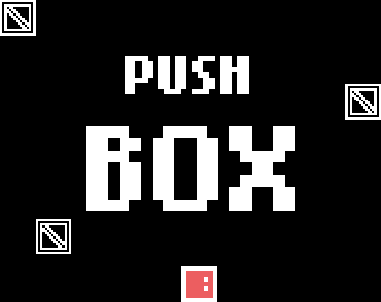

# Push Box

A puzzle game inspired by the classic Sokoban. Full game can be played in the web browser on (itch.io)[https://mastarcheeze.itch.io/push-box].

Made using Haxe and the Haxeflixel game engine. Levels created using Ogmo Editor 3. Graphics drawn using GraphicsGale. Sound effects made using Bfxr. Music composed using Bosca Ceoil.
